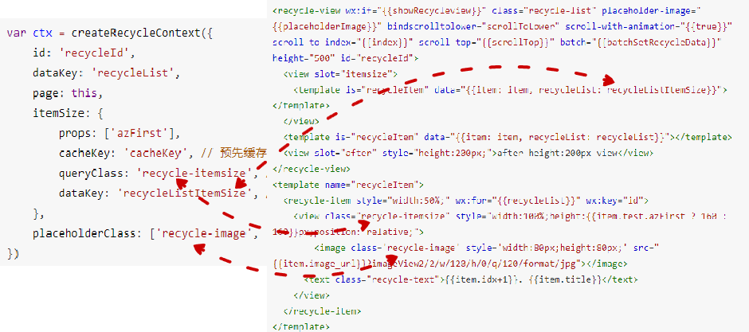

   itemSize主要是用于生成每条数据的宽高信息，有下面的2种宽高信息生成的方法。

   ### 1. 自动生成宽高

   基本的思路是提供少量的数据进行预先渲染，然后通过createSelectorQuery接口查询得到高度信息。

   JS的调用方法如下：

   ```javascript
   var ctx = createRecycleContext({
       id: 'recycleId',
       dataKey: 'recycleList',
       page: this,
       itemSize: {
           props: ['azFirst'],
           cacheKey: 'cacheKey', // 预先缓存的key
           queryClass: 'recycle-itemsize', // 动态查询的class
           dataKey: 'recycleListItemSize', // 预先渲染的数据的wx:for绑定的变量
       },
       placeholderClass: ['recycle-image', 'recycle-text']
   })
   ```

   itemSize的各个属性，要配合wxml的详细写法来生成，先看下wxml的写法：

   ```html
   <recycle-view wx:if="{{showRecycleview}}" class="recycle-list" placeholder-image="{{placeholderImage}}" bindscrolltolower="scrollToLower" scroll-with-animation="{{true}}" scroll-to-index="{{index}}" scroll-top="{{scrollTop}}" batch="{{batchSetRecycleData}}" height="500" id="recycleId">
     <view slot="itemsize">
       <template is="recycleItem" data="{{item: item, recycleList: recycleListItemSize}}"></template>
     </view>
     <template is="recycleItem" data="{{item: item, recycleList: recycleList}}"></template>
     <view slot="after" style="height:200px;">after height:200px view</view>
   </recycle-view>
   <template name="recycleItem">
     <recycle-item style="width:50%;" wx:for="{{recycleList}}" wx:key="id">
       <view class="recycle-itemsize" style="width:100%;height:{{item.test.azFirst ? 160 : 160}}px;position: relative;">
           <image class='recycle-image' style='width:80px;height:80px;' src="{{item.image_url}}?imageView2/2/w/120/h/0/q/120/format/jpg"></image>
         <text class="recycle-text">{{item.idx+1}}. {{item.title}}</text>
       </view>
     </recycle-item>
   </template>
   ```

   JS和wxml里面的class的对应关系如下图所示：

   

   还有2个属性props和cacheKey，其中props可以指定数据的多个key，长列表组件会自动聚合key对应的值，并取出数据进行预先渲染并查询得到高度。假设数据为

   ```javascript
   [{
       azFirst: true, // 对应高度130px
       ...
   }, {
       azFirst: false, // 对应高度120px
       ...
   }]
   ```

   props指定的`azFirst`对应的数据里面的属性。

   由于自动计算高度有一定耗时，可以指定cacheKey，长列表则会将计算的高度缓存起来，下次使用。当数据的宽高发生改变的时候，必须要重新指定一个cacheKey。

   当指定了`placeholderClass`之后，则会自动生成占位背景图设置在`recycle-view`组件的`placeholder-image`属性上。

   ### 2. 自己计算高度
